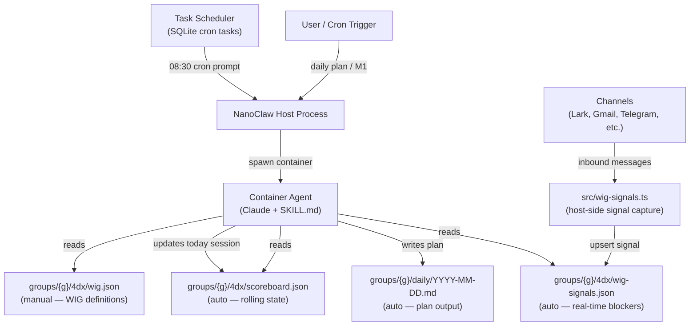
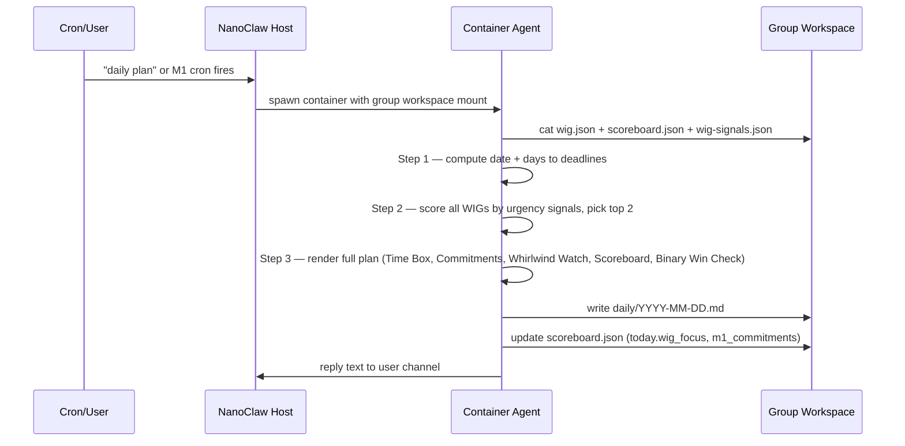

### Summary

`4dx-daily-plan` is a NanoClaw container skill that implements the **4 Disciplines of Execution (4DX)** morning ritual. It runs inside a Claude agent container, reads WIG (Wildly Important Goal) definitions and real-time channel signals from the host filesystem, then generates a structured daily plan (M1) — WIG selection, time-boxed schedule, lead measure commitments, whirlwind watch, and scoreboard. It is triggered by chat message or scheduled cron, and writes its output back to the group workspace.

---

### Architecture Diagram

---

### Flow Diagram

---

### Key Files

| File | Purpose |
|------|---------|
| `container/skills/4dx-daily-plan/SKILL.md` | Agent instructions — intent detection, all 4 steps, output format, commitment mutation flow |
| `.claude/skills/4dx-daily-plan/SKILL.md` | Installer skill — applies the skill, sets up crons, rebuilds container |
| `scripts/setup-4dx-crons.ts` | Registers M1 (08:30), M7 (16:00), Weekly (Fri 09:00) cron tasks in SQLite |
| `src/wig-signals.ts` | Host-side library called by channels — tags messages to WIG IDs, upserts/resolves signals |
| `groups/{g}/4dx/wig.json` | **Manual** — WIG definitions: name, area, deadline, lag metric, lead measures |
| `groups/{g}/4dx/scoreboard.json` | **Auto** — rolling scoreboard + today's session (wig_focus, m1_commitments, m7 fields) |
| `groups/{g}/4dx/wig-signals.json` | **Auto** — real-time blockers/resolutions from all channels (7-day TTL) |
| `groups/{g}/daily/YYYY-MM-DD.md` | **Auto** — daily plan output file |
| `docs/4dx-daily-plan.md` | Reference documentation for the full skill |

---

### Concepts

- **Two intents, one skill.** The agent detects intent before acting — Intent A generates the morning plan (Steps 1–4), Intent B mutates existing commitments (CM-1 through CM-5). No overlap.

- **WIG selection is scored, not manual.** The agent evaluates all WIGs against 7 urgency signals (deadline proximity, lag status, lead streak, open blockers) and auto-selects the top 2. Any WIG with a deadline ≤ 7 days is always auto-selected.

- **`wig-signals.json` is the anti-hallucination layer.** Channel handlers call `upsertWigSignal()` on every inbound message, tagging it to WIG IDs by keyword matching against `wig.json`. The agent reads this file to populate the Whirlwind Watch section and elevate WIG priority — it must not invent blockers.

- **Scoreboard is a rolling session file.** `scoreboard.json` holds both historical weekly data and a `today` object that is reset each M1 run. The M7 EOD skill (separate) writes back the `m7_*` fields after end of day.

- **Three scheduled rituals.** The cron script registers M1 (08:30 weekdays), M7 (16:00 weekdays), and Weekly Cadence (09:00 Friday) into SQLite. The task scheduler fires them as if the user sent a chat message — the same agent code handles both.

- **Output is Telegram-native.** The plan uses single-asterisk bold and avoids markdown tables — Telegram renders `*bold*` but not GFM tables. All sections (Time Box, Commitments, Scoreboard, Binary Win Check) are always emitted in full.

- **`wig.json` is the only manual file.** Everything else (`scoreboard.json`, `wig-signals.json`, daily plan `.md` files) is written automatically by the system. The user only authors and maintains WIG definitions.
