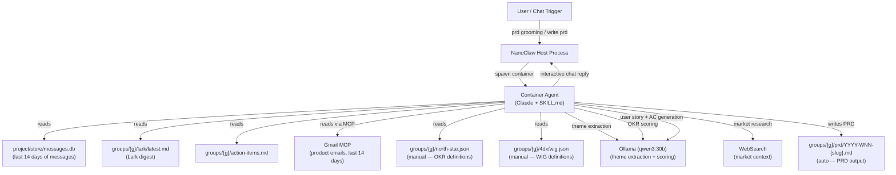
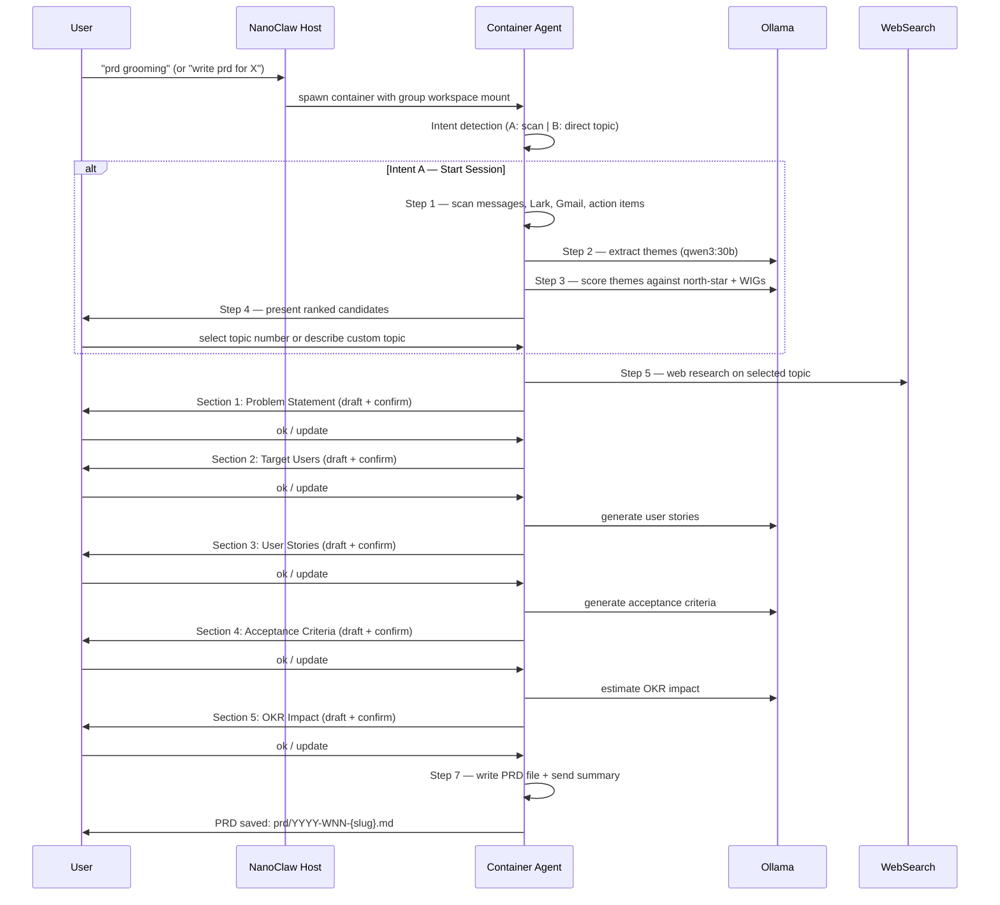

### Summary

`prd-grooming` is a NanoClaw container skill for interactive sprint grooming. It runs inside a Claude agent container, scans 14 days of team messages and emails for recurring themes, scores them against north-star objectives and WIGs, presents ranked topic candidates in chat, then walks through a section-by-section PRD draft with interactive editing at each step. The final PRD is saved to `prd/YYYY-WNN-{slug}.md` in the group workspace.

---

### Architecture Diagram

---

### Flow Diagram

---

### Key Files

| File | Purpose |
|------|---------|
| `container/skills/prd-grooming/SKILL.md` | Agent instructions — intent detection, 7-step flow, interactive PRD sections, output format |
| `.claude/skills/prd-grooming/SKILL.md` | Installer skill — applies the skill, rebuilds container |
| `.claude/skills/prd-grooming/manifest.yaml` | Skill metadata |
| `groups/{g}/prd/YYYY-WNN-{slug}.md` | **Auto** — PRD output files |
| `groups/{g}/north-star.json` | **Manual** — OKR objectives + key results (alignment source) |
| `groups/{g}/4dx/wig.json` | **Manual** — WIG definitions + lag_status (alignment source) |
| `project/store/messages.db` | **Auto** — SQLite message history (scanned last 14 days) |
| `groups/{g}/lark/latest.md` | **Auto** — Lark digest (scanned if available) |

---

### Concepts

- **Two intents, one skill.** Intent A (no topic) triggers full scanning and candidate selection. Intent B (topic named in message) skips scanning and goes straight to research and drafting.

- **Ollama does the heavy lifting.** Three Ollama calls: (1) extract themes from raw messages, (2) score themes against OKRs and WIGs, (3) generate user stories and acceptance criteria. Ollama keeps the main context clean and avoids expensive Claude API calls for bulk text processing.

- **North-star alignment is the ranking signal.** Themes are scored by alignment to `north-star.json` objectives and `wig.json` WIGs. Themes that align to an `at_risk` or `losing` WIG/KR get a priority boost — surfacing the most strategically urgent topics first.

- **Interactive, not batch.** Each PRD section is sent to chat as a draft for user confirmation before moving on. The user can accept, update, add to, or skip any section.

- **Graceful degradation.** If Ollama is unavailable, the agent generates sections itself. If Gmail MCP is unavailable, it scans the other sources only. If `north-star.json` is missing, it skips OKR alignment. The session never aborts due to a missing optional source.

- **Output is Telegram-native for chat, GFM for the file.** Chat replies use single-asterisk bold and no markdown tables. The saved `.md` file uses full GFM including tables for user stories and acceptance criteria.
