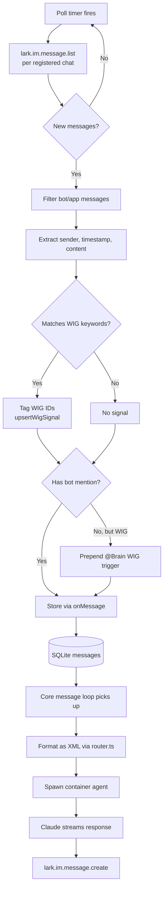
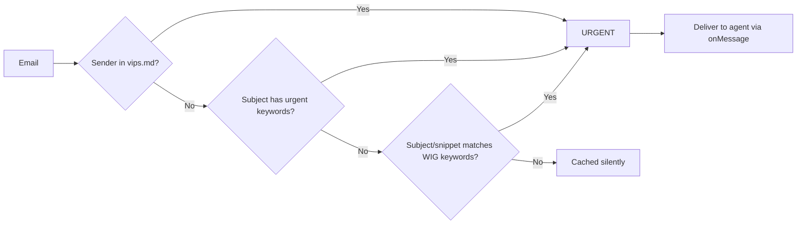
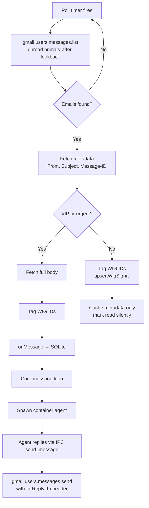
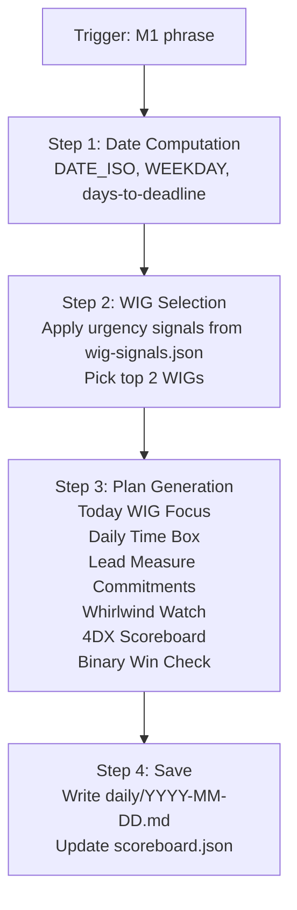
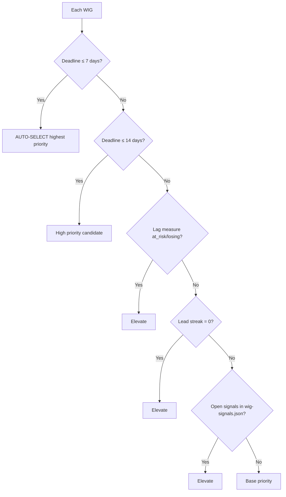
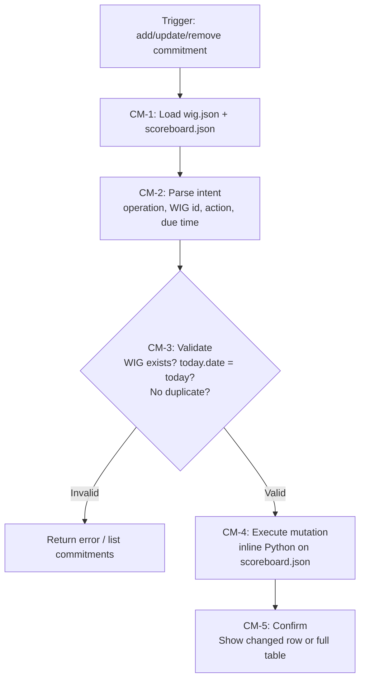
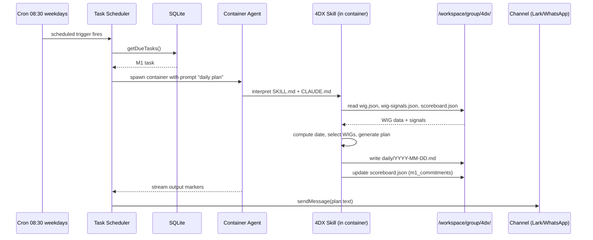
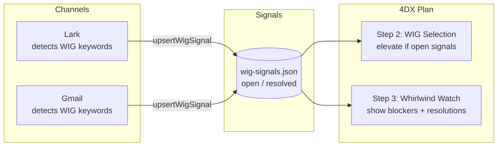
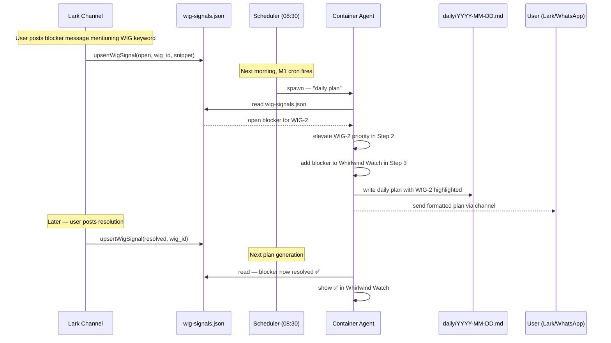

# NanoClaw Channels & Skills Playbook

Covers: **Lark channel**, **Gmail channel**, and **4DX Daily Plan skill**.

---

## Table of Contents

1. [System Architecture Overview](#1-system-architecture-overview)
2. [Core Components](#2-core-components)
3. [Lark Channel](#3-lark-channel)
4. [Gmail Channel](#4-gmail-channel)
5. [4DX Daily Plan Skill](#5-4dx-daily-plan-skill)
6. [Cross-Feature Integration](#6-cross-feature-integration)
7. [Data & Folder Structure](#7-data--folder-structure)

---

## 1. System Architecture Overview

NanoClaw is a single Node.js orchestrator process. Channels self-register at startup and push messages into a central SQLite store. A message loop polls the store and dispatches messages to Claude agents running inside Linux containers. Agent responses stream back to the originating channel.

```mermaid
graph TB
    subgraph Channels
        L[Lark<br/>poll 15 min]
        G[Gmail<br/>poll 1 hr]
        WA[WhatsApp / Telegram / Slack / Discord]
    end

    subgraph Orchestrator["Orchestrator (src/index.ts)"]
        REG[Channel Registry]
        DB[(SQLite)]
        LOOP[Message Loop]
        SCHED[Task Scheduler]
        IPC[IPC Watcher]
        DIGEST[Digest Runner]
    end

    subgraph Container["Agent Container (Linux VM)"]
        CLAUDE[Claude Agent SDK]
        SKILL[Skills / CLAUDE.md]
        WS[/workspace/group]
    end

    L -->|onMessage| REG
    G -->|onMessage VIP/urgent| REG
    WA -->|onMessage| REG
    REG --> DB
    LOOP -->|getNewMessages| DB
    LOOP -->|spawn| Container
    CLAUDE -->|stdout markers| LOOP
    LOOP -->|sendMessage| REG
    REG --> L
    REG --> G
    REG --> WA
    SCHED -->|getDueTasks| DB
    SCHED -->|spawn| Container
    IPC -->|/workspace/ipc| DB
    DIGEST -->|write cache| WS
```

---

## 2. Core Components

| File | Role |
|------|------|
| `src/index.ts` | Orchestrator — state, message loop, agent invocation |
| `src/channels/registry.ts` | Channel self-registration at startup |
| `src/channels/lark.ts` | Lark/Feishu poll channel |
| `src/channels/gmail.ts` | Gmail poll channel |
| `src/container-runner.ts` | Spawns agent containers with volume mounts |
| `src/task-scheduler.ts` | Runs scheduled/cron tasks |
| `src/ipc.ts` | Reads agent-written IPC files, dispatches commands |
| `src/router.ts` | Formats messages as XML; routes outbound text |
| `src/wig-signals.ts` | Upserts blocker/resolution signals from all channels |
| `src/db.ts` | SQLite operations |
| `container/skills/4dx-daily-plan/SKILL.md` | In-container skill instructions |

---

## 3. Lark Channel

### How It Works

- **Transport**: REST polling via `@larksuiteoapi/node-sdk`
- **Poll interval**: 15 minutes (configurable `LARK_POLL_INTERVAL_MS`)
- **Lookback**: 24 hours on first run, then cursor-tracked per chat
- **WIG awareness**: Loads `groups/{folder}/4dx/wig.json`, tags messages that match WIG keywords, upserts signals to `wig-signals.json`
- **Bot mention detection**: Matches bot's `open_id` or display name; prepends trigger pattern if WIG-related

### Process Flow



### Sequence Diagram

```mermaid
sequenceDiagram
    participant Timer
    participant Lark as Lark Channel
    participant API as Lark API
    participant DB as SQLite
    participant Loop as Message Loop
    participant Ctr as Container Agent

    Timer->>Lark: poll interval fires
    Lark->>API: im.message.list(chat_id, start_time)
    API-->>Lark: messages[]
    Lark->>Lark: filter bot messages, detect mention, tag WIG
    Lark->>DB: onMessage() — store message
    Loop->>DB: getNewMessages()
    DB-->>Loop: new messages
    Loop->>Ctr: spawn with XML prompt
    Ctr-->>Loop: stream output markers
    Loop->>API: im.message.create(chat_id, text)
```

### Key Configuration

| Variable | Default | Purpose |
|----------|---------|---------|
| `LARK_APP_ID` | — | App credentials |
| `LARK_APP_SECRET` | — | App credentials |
| `LARK_DOMAIN` | larksuite.com | International vs Feishu |
| `LARK_POLL_INTERVAL_MS` | 900000 | 15 min poll |

---

## 4. Gmail Channel

### How It Works

- **Transport**: Google Gmail API v1 (OAuth2 via `googleapis`)
- **Poll interval**: 1 hour (configurable `GMAIL_DIGEST_INTERVAL_MS`)
- **Filter**: `is:unread category:primary after:{epoch}`
- **Delivery rules**: Only VIP senders or urgent emails are delivered to the agent immediately. All others are silently cached (available via MCP during briefing).
- **WIG awareness**: Checks subject + snippet for WIG keywords; upserts signals even for silent emails
- **Reply threading**: Stores thread metadata (sender, subject, message-id) for `In-Reply-To` headers

### Urgency Detection Logic



### Process Flow



### Sequence Diagram

```mermaid
sequenceDiagram
    participant Timer
    participant Gmail as Gmail Channel
    participant GmailAPI as Gmail API
    participant VIP as vips.md / wig.json
    participant DB as SQLite
    participant Loop as Message Loop
    participant Ctr as Container Agent

    Timer->>Gmail: poll interval fires
    Gmail->>GmailAPI: messages.list(unread, primary)
    GmailAPI-->>Gmail: message IDs
    Gmail->>GmailAPI: messages.get(id, metadata)
    GmailAPI-->>Gmail: From, Subject, Message-ID
    Gmail->>VIP: check VIP list & WIG keywords
    alt VIP or urgent
        Gmail->>GmailAPI: messages.get(id, full)
        GmailAPI-->>Gmail: body text
        Gmail->>DB: onMessage() — store for agent
        Loop->>DB: getNewMessages()
        Loop->>Ctr: spawn with XML prompt
        Ctr-->>Loop: stream response
        Loop->>GmailAPI: messages.send (threaded reply)
    else silent
        Gmail->>DB: upsertWigSignal if WIG-related
        Gmail->>Gmail: cache thread metadata
    end
```

### Key Configuration

| Variable | Default | Purpose |
|----------|---------|---------|
| `GMAIL_DIGEST_INTERVAL_MS` | 3600000 | 1 hr poll |
| `GMAIL_DIGEST_LOOKBACK_HOURS` | 24 | Lookback window |
| `~/.gmail-mcp/gcp-oauth.keys.json` | — | OAuth client credentials |
| `~/.gmail-mcp/credentials.json` | — | Access/refresh tokens |

---

## 5. 4DX Daily Plan Skill

### How It Works

The skill runs **inside the container agent**. It is triggered by specific phrases and reads/writes from the group's `/workspace/group/4dx/` folder. It also has cron-scheduled auto-triggers registered by `scripts/setup-4dx-crons.ts`.

### Intent Detection

| Trigger phrase | Intent | Action |
|---------------|--------|--------|
| "daily plan", "morning plan", "M1", "today plan", "what should I focus on today" | Generate plan | Run Steps 1–4 |
| "add commitment", "update M1", "WIG N + verb" | Mutate commitments | Run CM-1 to CM-5 |

### Morning Plan Generation (Steps 1–4)



### WIG Priority Rules (Step 2)



### Commitment Mutation Flow (CM-1 to CM-5)



### Sequence Diagram — Scheduled Morning Plan



### Scheduled Tasks

| Task | Cron | Purpose |
|------|------|---------|
| M1 Daily Plan | `30 8 * * 1-5` | Morning plan at 08:30 weekdays |
| M7 EOD Summary | `0 16 * * 1-5` | End-of-day review at 16:00 weekdays |
| Weekly Cadence | `0 9 * * 5` | Weekly review at 09:00 Friday |

---

## 6. Cross-Feature Integration

### WIG Signals — Shared Data Bus

All three features share `wig-signals.json` as a live signal bus:



### Full End-to-End Flow — Blocker to Plan



---

## 7. Data & Folder Structure

```
groups/{folder}/
├── CLAUDE.md                 # Group memory & persistent context
├── vips.md                   # VIP sender list (Gmail urgency)
├── 4dx/
│   ├── wig.json              # WIG definitions (deadlines, leads, areas)
│   ├── scoreboard.json       # Session state (focus WIGs, M1 commitments, M7 verdict)
│   └── wig-signals.json      # Blocker/resolution signals (Lark + Gmail sourced)
├── daily/
│   └── YYYY-MM-DD.md         # Daily plan output
├── lark/
│   └── latest.md             # Lark digest cache (written by digest-runner)
└── gmail/
    └── latest.md             # Gmail digest cache (written by digest-runner)
```

### Key JSON Schemas

**`wig.json`** — WIG definitions:
```json
{
  "wigs": [
    {
      "id": "WIG-1",
      "name": "...",
      "area": "Farmer",
      "deadline": "2026-06-30",
      "lag_measure": "...",
      "lead_measures": ["...", "..."],
      "keywords": ["...", "..."]
    }
  ]
}
```

**`scoreboard.json`** — Session state:
```json
{
  "today": {
    "date": "2026-03-17",
    "wig_focus": ["WIG-1", "WIG-2"],
    "m1_commitments": [
      { "wig": "WIG-1", "lead_measure": "...", "action": "...", "due": "12:00" }
    ],
    "m7_verdict": null
  }
}
```

**`wig-signals.json`** — Active signals:
```json
{
  "signals": [
    {
      "wig_id": "WIG-1",
      "status": "open",
      "channel": "lark",
      "correlation_key": "lark:chat-abc123",
      "snippet": "...",
      "first_ts": "2026-03-17T09:00:00Z"
    }
  ]
}
```
