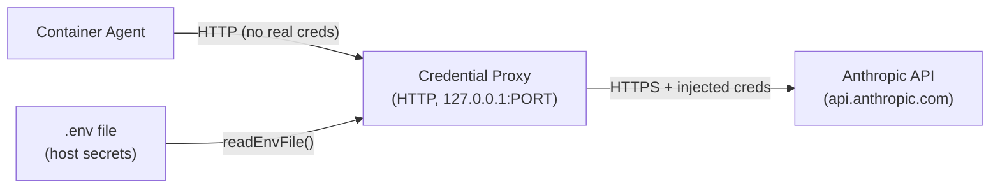
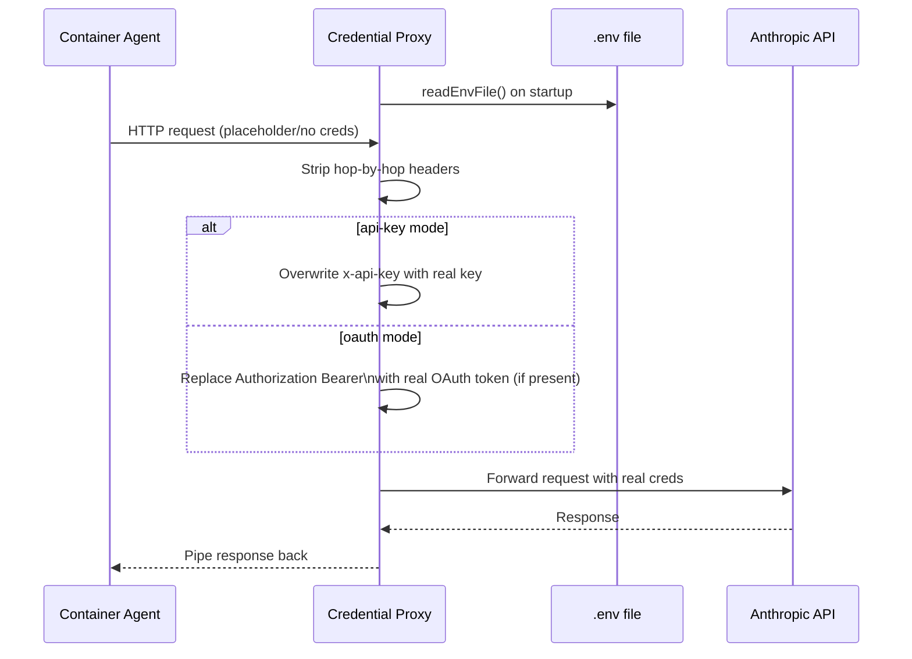

# Credential Proxy

### Summary

`credential-proxy.ts` is a lightweight HTTP proxy that sits between containerized Claude agents and the Anthropic API. Containers never hold real credentials — the proxy intercepts all outbound API calls and injects the host's secrets before forwarding upstream. It supports two auth modes: direct API key injection, or OAuth token injection for the Bearer-based token-exchange flow.

---

### Architecture diagram

---

### Flow diagram

---

### Key files

| File | Purpose |
|------|---------|
| `src/credential-proxy.ts` | The proxy server itself |
| `src/env.ts` | `readEnvFile()` — reads secrets from `.env` on the host |
| `src/logger.ts` | Structured logging (pino) |
| `src/container-runner.ts` | Spawns containers; sets `ANTHROPIC_BASE_URL` to point at this proxy |

---

### Concepts

- **Credential isolation** — containers receive a `ANTHROPIC_BASE_URL` pointing at `127.0.0.1:<port>` instead of the real API. They never see `ANTHROPIC_API_KEY` or OAuth tokens.
- **Two auth modes** — `api-key`: every request gets `x-api-key` overwritten. `oauth`: only requests that already carry an `Authorization` header get the real Bearer token injected (the token-exchange path); post-exchange requests carry a temp API key and pass through untouched.
- **Mode auto-detection** — `detectAuthMode()` checks for `ANTHROPIC_API_KEY` in `.env`; if absent, assumes OAuth. `startCredentialProxy()` does the same inline at startup.
- **Hop-by-hop header stripping** — `connection`, `keep-alive`, and `transfer-encoding` are removed before forwarding, as required by HTTP proxy spec.
- **HTTP or HTTPS upstream** — `ANTHROPIC_BASE_URL` can point at an HTTP endpoint (e.g. a local mock), making the proxy useful in tests as well as production.
- **Single point of credential management** — rotating a key or token only requires updating `.env` on the host; no container rebuild needed.
